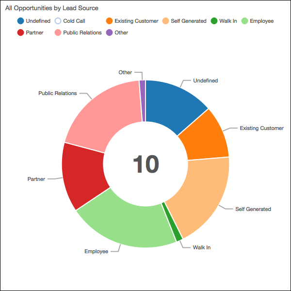
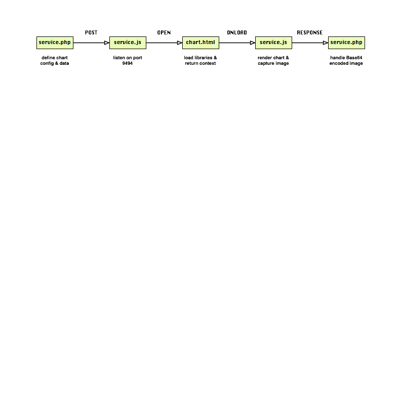
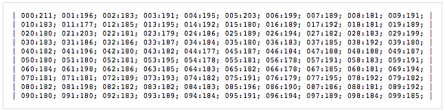

# PhantomJS SVG to PNG Service

## Overview
A *service* that will generate a Base64 encoded PNG image file from a D3 chart using [PhantomJS](|http://phantomjs.org/).

## Installation
The PhantomJS binary can be installed globally with [Homebrew](http://brew.sh/) or locally with [Composer](https://github.com/jakoch/phantomjs-installer).

```sh
// Use homebrew to install PhantomJS globally
$ brew install phantomjs
// Use composer to install PhantomJS locally into ./bin folder
curl -s http://getcomposer.org/installer | php
php composer.phar install
```

## Basic usage from command line
During development it is helpful to verify the successful phantomjs capture of the various Sugar NVD3 chart types that will be tested via the service. The service source URI `test/chart.php` can be edited as needed and called directly from the command lin. An option will be added later to provide the chart config as a JSON object.

```sh
// [./bin/]phantomjs [script] [source_url] [selector] [target_file]
$ phantomjs ./test/domshot.js http://localhost/svg2png/test/chart.php .nv-chart pie.png
```

There should now be a new PNG image of the chart in the project directory.

<a href="pie.png" target="_blank"></a>

## PhantomJS web server module
As a *service* the PhantomJS [web server module](http://phantomjs.org/api/webserver/) based on the embedded [Mongoose](https://www.cesanta.com/) web server is deployed as a long running process.
```sh
// Call ./bin/phantomjs if installed locally
phantomjs service.js
```

## Debugging
The `service.js` script can be debugged interactively by launching with:
```sh
phantomjs --remote-debugger-port=9000 --remote-debugger-autorun=yes ./service.js
```
Open a browser to `http://localhost:9000/` and click on the `service.js` item. The browser debug environment is similar to Chrome Web Tools but double clicking might be necessary.

## Docker
The service can be dockerized by running:
```sh
docker build -t svg2png-dock .
docker run -p 8910:8910 svg2png-dock
```
The docker image is built with https://hub.docker.com/r/wernight/phantomjs/ which has over 1 million pulls.

## Testing
Test the *service* by:

1. start the service on the remote host: `phantomjs ./service.js`
2. open a browser at: `http://localhost/svg2png/test/service.php`
3. the test chart config and report data parameters are defined and a AJAX POST is made to: `http://remotehost:8910/`
4. PhantomJS executes the listen on port 8910 callback script defined in: `./service.js`
  * the post parameters are processed and referenced in an onloadcomplete callback of the render page: `./chart.html`
    - the render page loads libraries and resources and completes
    - the onloadcomplete callback then executes D3 code to render the chart in the context of the test page
  * the rendered chart is rasterized by PhantomJS as a PNG image and Base64 encoded
5. the service returns the Base64 encoded string in a response back to: `http://localhost/svg2png/test/service.php`
6. a new image is appended to the body using the response string as its DataURI source.

The encoded image could be saved by the client application using internal methods.



A load testing script `test/load.php` executes 100 POST requests to the service and reports the response time to the screen.



On local test runs the average response time was ~186 ms.

## Response
The *service* returns the captured chart image as a Base64 encoded string back to the client application.

## Request
The *service* expects a POST request with two (for now) data parameters to the `8910` port (configurable) of the service address:
- `CHART_CONFIG` a JSON object that contains a required chart `type` property and any needed method names to call and values to apply to the D3 chart model as key/value pairs (e.g., `showTitle: true`).
- `REPORT_DATUM` a JSON object that contains the report data as normally constructed in the `Sugar` client application with `properties` and `data` properties.
- ~~`POSTBACK`~~ not yet implemented but expected to post back the Base64 encoded image to the client application.

### Post parameters
A Swagger.io service definition file is available: [definition.swagger.json](definition.swagger.json).

#### Chart config
The Chart.php page expects a JSON CHART_CONFIG POST parameter that sets the chart type and calls any number of optional methods to configure the chart model. Every chart type has a number of chart config options. Refer to the `include/SugarCharts/nvd3/js/sugarCharts.js` file to see common options for each chart type.

| Method | Required | Acceptable Values | Description |
| ------ | -------- | ----------------- | ----------- |
|`type`| (required) | ['pie'\|'multibar'\|'funnel'\|'line'] | Defines the NVD3 chart model type to load |
| `colorData` | (required) | ['default'\|'data'\|'classes'] | Sets the color palette options.|
| `direction` | (optional) | ['ltr'\|'rtl'] | Sets the rendering direction |
| `showTitle` | (optional) | [true\|false] | ... |
| `showLegend` | (optional) | [true\|false] | ... |
| `showLabels` | (optional) | [true\|false] | ... |

To set these options, add a key/value pair with the key equal to the name of the method. This is an example of options for configuring the pie chart type as a donut chart.

```json
{
  "type": "pie",
  "colorData": "default",
  "direction": "ltr",
  "showTitle": true,
  "showLegend": true,
  "showLabels": true,

  "donut": true,
  "donutRatio": 0.5,
  "hole": 10,
  "maxRadius": 250,
  "minRadius": 100,
  "rotateDegrees": 0,
  "arcDegrees": 360,
}
```

#### Report data
The the `include/SugarCharts/nvd3/js/sugarCharts.js` file for the expected report data structure. Here is the datum used for the POC.

```json
{
  "properties": {
    "title": "All Opportunities by Lead Source"
  },
  "data": [
    {
      "key": "Undefined",
      "value": 100
    },
    {
      "key": "Cold Call",
      "value": 0
    },
    {
      "key": "Existing Customer",
      "value": 75
    },
    {
      "key": "Self Generated",
      "value": 140
    },
    {
      "key": "Walk In",
      "value": 10
    },
    {
      "key": "Employee",
      "value": 160
    },
    {
      "key": "Partner",
      "value": 100
    },
    {
      "key": "Public Relations",
      "value": 145
    },
    {
      "key": "Other",
      "value": 9
    }
  ]
}
```
