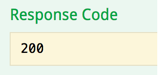

# Sugar Report to Chart Image Service

## Overview
**Report2Chart** is a *service* that will generate a Base64 encoded PNG image file from a D3 chart using [PhantomJS](|http://phantomjs.org/) given a Chart Config and Report Data from SugarCRM.

[Command Line](#basic-usage-from-command-line) |
[Web Server Module](#phantomjs-web-server-module) |
[Debugging](#debugging) |
[Docker](#docker) |
[Testing](#testing) |
[Response](#response) |
[Request](#request)

## Installation and Usage
The PhantomJS binary can be installed globally with [Homebrew](http://brew.sh/) or locally with [Composer](https://github.com/jakoch/phantomjs-installer). Or see [Docker](#docker) section below.

```sh
// Use homebrew to install PhantomJS globally
$ brew install phantomjs
// Use composer to install PhantomJS locally into ./bin folder
curl -s http://getcomposer.org/installer | php
php composer.phar install
```

### Basic usage from command line
During development it is helpful to verify the successful PhantomJS capture of the various Sugar NVD3 chart types that will be tested via the service. PhantomJS can be used from the command line using the same script that is used in the service to generate a new PNG image of the chart in the project directory.

```sh
// [./bin/]phantomjs [script] [source_url] [selector] [target_file]
$ phantomjs ./test/domshot.js http://localhost/report2chart/test/chart.php .nv-chart pie.png
```

<a href="readme/pie.png" target="_blank"></a>

Also, you can preview the chart by opening the page `test/chart.php` which can be edited as needed for testing. An option will be added later to provide the chart config as a JSON object. See the [Testing](#testing) section below for details on calling the PhantomJS service from a test page.

### PhantomJS web server module
As a *service* the PhantomJS [web server module](http://phantomjs.org/api/webserver/) based on the embedded [Mongoose](https://www.cesanta.com/) web server is deployed as a long running process.
```sh
// Call ./bin/phantomjs if installed locally
phantomjs service.js
```

### Debugging
The `service.js` script can be debugged interactively by launching with:
```sh
phantomjs --remote-debugger-port=9000 --remote-debugger-autorun=yes ./service.js
```
Open a browser to `http://localhost:9000/` and click on the `service.js` item. The browser debug environment is similar to Chrome Web Tools but double clicking might be necessary.

### Docker
The service can be dockerized by running:
```sh
docker build -t report2chart-dock .
docker run -p 8910:8910 report2chart-dock
```
The docker image is built with [wernight/phantomjs](https://hub.docker.com/r/wernight/phantomjs/) which has over 1 million pulls from Docker Hub.


## API Specification

The Report2Chart service API is developed using the [Swagger.io](http://swagger.io) specification and tools. The specification is defined in the `swagger.json` or `swagger.yaml` files and the [API Documentation ](#api-docs) has been generated using the [API Editor](#api-editor).

### <a name="api-docs"></a>API Documentation

The static documentation can be viewed at: [/report2chart/swagger-docs/](./swagger-docs/)


### <a name="api-editor"></a>API Editor

To edit the service specification or documenation the [Swagger Editor](http://swagger.io/swagger-editor/) should be installed.

#### Install editor the easy way

```shell
cd /report2service
wget https://github.com/swagger-api/swagger-editor/releases/download/v2.10.5/swagger-editor.zip
unzip swagger-editor.zip
rm swagger-editor.zip
open http://localhost/report2chart/swagger-editor/?url=../swagger.yaml
```

After installation the editor can be launched at: [/report2chart/swagger-editor/?url=../swagger.yaml#!/](./swagger-editor/?url=../swagger.yaml#!/)


While editing the YAML file in the left pane, the changes can be previewed on the right. Unfortunately the "Try this operation" button does not currently work. This is a limitation of the PhantomJs web server module (it does not support CORS preflight OPTIONS request: `curl -v -X OPTIONS 127.0.0.1:8910`). Instead, to verify your changes, generate the [API Server](#api-server) using the **| Generate Server > Node.js** menu item.


After editing, download and save the `swagger.yaml` and `swagger.json` files and then generate the [API Documentation](#api-docs) using the **| Generate Client > Dynamic HTML** menu item.


### <a name="api-server"></a>API Server

Please test your changes to the API specification before updating the `swagger.json` or `/report2service/swagger-docs/`. You will need to regenerate a testing server from the [API Editor](#api-editor).

Generate the server, then extract and copy the server into `/report2service/swagger-server/` and then start the Swagger server:

```shell
cd /report2service
mv ~/Downloads/node-server-server.zip swagger-server.zip
unzip swagger-server.zip
rm swagger-server.zip
cd swagger-server
npm start
#listening on http://localhost:8080
```

Once the testing server is up and running, you can view and test the "live" documentation at: http://localhost:8080/docs/

<a href="readme/swagger-server-full.png" target="_blank"></a>

The service end points can be tested by:
1. expanding an end point label,

  

2. clicking on the example block,

  

3. editing the report data (as desired),

  

4. then clicking the "Try it out" button.

  

You should see a 200 response if your edit to the API Specification are correct.

  

### Swagger.io documentation
* Swagger.io specifications: http://swagger.io/specification/
* Swagger-ui: https://github.com/swagger-api/swagger-ui/tree/2.x
* NPM modules: https://www.npmjs.com/package/swagger | https://www.npmjs.com/package/swagger-ui
* Swagger tutorial: https://apihandyman.io/writing-openapi-swagger-specification-tutorial-part-1-introduction/


## Testing
Test the *service* by:

1. start the service on the remote host: `phantomjs ./service.js`
2. open a browser at: `http://localhost/report2chart/test/service.php`
3. the test chart config and report data parameters are defined and a AJAX POST is made to: `http://remotehost:8910/`
4. PhantomJS executes the listen on port 8910 callback script defined in: `./service.js`
  * the post parameters are processed and referenced in an onloadcomplete callback of the render page: `./chart.html`
    - the render page loads libraries and resources and completes
    - the onloadcomplete callback then executes D3 code to render the chart in the context of the test page
  * the rendered chart is rasterized by PhantomJS as a PNG image and Base64 encoded
5. the service returns the Base64 encoded string in a response back to: `http://localhost/report2chart/test/service.php`
6. a new image is appended to the body using the response string as its DataURI source.

The encoded image could be saved by the client application using internal methods.


A load testing script `test/load.php` executes 100 POST requests to the service and reports the response time to the screen.


On local test runs the average response time was ~186 ms.

## Response
The *service* returns the captured chart image as a Base64 encoded string back to the client application.

## Request
The *service* expects a POST request with two (for now) `application/json` data parameters to the `8910` port (configurable) of the service address:
- `CHART_CONFIG` a JSON object that contains a required chart `type` property and any needed method names to call and values to apply to the D3 chart model as key/value pairs (e.g., `showTitle: true`).
- `REPORT_DATUM` a JSON object that contains the report data as normally constructed in the `Sugar` client application with `properties` and `data` properties.
- ~~`POSTBACK`~~ not yet implemented but expected to post back the Base64 encoded image to the client application.

### Post parameters
A [Swagger.io](http://swagger.io) service definition file is available: [swagger.json](swagger.json).

#### Chart config
The CHART_CONFIG POST parameter sets the chart type and calls any number of optional methods to configure the chart model. Every chart type has a number of chart config options. Refer to the [API Documentation](./swagger-docs/) to see config options for each chart type. As an example, lets look at some common chart config settings.

| Method | Required | Acceptable Values | Description |
| ------ | -------- | ----------------- | ----------- |
|`type` | (required) | ['pie'\|'multibar'\|'funnel'\|'line'] | Defines the NVD3 chart model type to load |
| `colorData` | (required) | ['default'\|'data'\|'classes'] | Sets the color palette options.|
| `direction` | (optional) | ['ltr'\|'rtl'] | Sets the rendering direction |
| `showTitle` | (optional) | [true\|false] | ... |
| `showLegend` | (optional) | [true\|false] | ... |
| `showLabels` | (optional) | [true\|false] | ... |

To set these options, add a key/value pair with the key equal to the name of the method.

```json
{
  "type": "pie",
  "colorData": "default",
  "direction": "ltr",
  "showTitle": true,
  "showLegend": true,
  "showLabels": true,
}
```

#### Report data
The REPORT_DATUM POST parameter normally contains two elements: a "properties" object with metadata about the report, and an array of series objects. Each series object can have a single "value" property, or a "values" property containing an array of arrays, or an array of objects. Refer to the [API Documentation](./swagger-docs/) to see the metadata and value options for each chart type.

*Values as single value*
```json
{
  "properties": {"title": "My Pie Chart"},
  "data": [
    {"key": "Series 1", "value": 123},
    {"key": "Series 2", "value": 456},
    {"key": "Series 3", "value": 789}
  ]
}
```

*Values as array of arrays*
```json
{
  "properties": {"title": "My Line Chart"},
  "data": [
    {"key": "Series 1", "values": [[1, 123], [2, 456], [3, 789]]},
    {"key": "Series 2", "values": [[1, 321], [2, 654], [3, 987]]}
  ]
}
```

*Values as array of objects*
```json
{
  "properties": {"title": "My Multibar Chart"},
  "data": [
    {"key": "Series 1", "values": [{"x": 1, "y": 123}, {"x": 2, "y": 456}, {"x": 3, "y": 789}]},
    {"key": "Series 2", "values": [{"x": 1, "y": 321}, {"x": 2, "y": 654}, {"x": 3, "y": 987}]}
  ]
}
```
